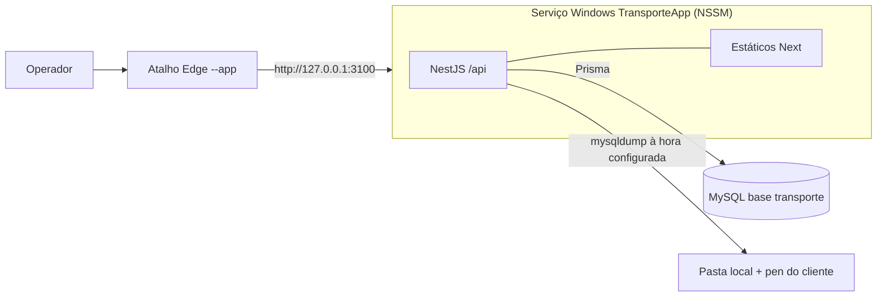

# Plano de execução: Gestão de Transporte Escolar

Serviço de transporte particular de um colégio: alunos, rotas, mensalidades, pagamentos e devedores, instalado num computador **sem internet** com NestJS, Next.js (exportação estática) e o MySQL já existente no PC do cliente.

| Início | Entrega e formação | Trabalho útil | Instalação | Execução |
|---|---|---|---|---|
| Qui 17/09 | Sex 18/09 | ~17 h | Offline | 1 serviço Windows, porta 3100 |

Origem: artefacto "Plano de execução — Gestão de Transporte Escolar" (revisto a 17/09/2026). Substitui o plano de gestão escolar de 16/09.

---

## 0. Estado da execução

Legenda: `[x]` feito · `[~]` em curso · `[ ]` por fazer · 👤 tarefa manual (não é código) · 🚩 ponto de controlo

### Fase 1 — Base e núcleo (Qui 17/09, ~10 h)

- [ ] 👤 Enviar a mensagem da secção 15 (âmbito, rotas, valores, Excel de alunos)
- [x] Desbloquear ambiente: dependências da API e do web, MySQL de desenvolvimento em Docker (`transporte-mysql`, porta 3307)
- [x] Base: schema, migration `init`, seed (admin, Empresa, ConfigBackup; `--demo` com dados de exemplo), login, guards, layout com menu
- [x] Configuração: empresa (dados, logótipo, financeiro, taxas), anos lectivos, rotas, utilizadores
- [x] Alunos e inscrição: ficha, encarregado, inscrição com mensalidades, valor especial, lista com filtros
- [~] 🚩 Build de produção (**feito**: `node dist/main.js` serve os 19 ecrãs com refresh, sem pedidos externos) · 👤 falta: commit + push, tag `v0.1`, ZIP do workflow, instalação no PC do cliente, reinício
- [x] Pagamentos e recibo: extracto, pagar vários meses e adiantados, multa, recibo A4 com 2 vias, anulação
- [x] Mapa mensal: aluno × meses com cor e símbolo, filtros, totais por mês, acções por célula, suspender e reactivar

> Verificado a 17/09: 10 testes unitários (`npm test`), teste de fumo da API com 55+ verificações (inclui cópia, restauro e confirmação em lote contra o MySQL em Docker) e percurso dos 19 ecrãs no Edge sem erros de consola nem pedidos externos.

### Fase 2 — Listas, empacotar, entregar (Sex 18/09, ~8 h)

- [x] Devedores, pagos (por mês e por data) e lista por rota, com impressão
- [x] Confirmação individual e em lote, mudança de rota, cancelamento, actualização em massa de valores
- [x] Importação de Excel (modelo gerado no browser, leitura SheetJS, pré-visualização, erros por linha)
- [x] Cópias de segurança no sistema (agendador, verificar pasta, cópia, histórico, restauro, bloqueio de escritas, aviso no painel)
- [x] Painel (indicadores, ocupação das rotas, últimos pagamentos, aviso de cópias)
- [ ] 👤 Validar o agendador e a pen no Windows real (em desenvolvimento as cópias correm dentro do contentor Docker)
- [ ] 🚩 👤 Testes de aceitação (secção 12) no PC do cliente com a rede desligada; limpar dados de teste
- [ ] 👤 Instalação final, configuração com o cliente, importação de alunos, formação, termo de aceitação

### Ordem de corte se atrasar

1. Painel (manter só o aviso de cópias)
2. Importação de Excel
3. Confirmação em lote (fica a individual)
4. Logótipo

> **Regra de ouro:** correr o build de produção pelo menos duas vezes por dia.

---

## 1. Decisões fechadas

| Tema | Decisão | Porquê |
|---|---|---|
| Repositório | Reaproveitar este repositório (base de 16/09) e trocar schema e módulos de negócio | Poupa horas: auth, guards, UI, impressão, workflow e scripts já existem |
| Backend | NestJS 11 + Prisma **6.19.3** fixado (motores binários, `binaryTargets`) | O pacote offline pressupõe motores binários; Prisma 7 muda o gerador |
| Frontend | Next.js 16 com `output: 'export'`, `trailingSlash: true`, só componentes client | HTML estático servido pelo Nest: um processo, uma porta |
| UI | Componentes Tailwind próprios (já feitos) + React Hook Form + TanStack Query | O CLI do shadcn precisa de rede e custa tempo; resultado equivalente |
| Base de dados | Produção: MySQL do cliente, base `transporte`, utilizador `transporte_app`. Desenvolvimento: MySQL 8 em Docker (porta 3307) | Não há MySQL na máquina de desenvolvimento |
| Autenticação | JWT (8 h) em cookie `httpOnly`, `bcryptjs`, perfis ADMIN e OPERADOR | Sem módulos nativos |
| Instalação | ZIP montado em Windows x64 (GitHub Actions) com `node_modules` e motores do Prisma, levado em pen | O PC não tem internet |
| Parâmetros do negócio | Rotas, valores, meses cobrados, prazos, multa e taxas configuráveis no sistema | Não depende do cliente para desenvolver |
| Colégio, classe e turma | Campos de texto com sugestões (sem tabelas próprias) | Informação de contexto; poupa três CRUDs |
| Impressão | `@media print` + `window.print()` | Sem PDF no servidor |
| Execução | Serviço NSSM dependente do MySQL; atalho Edge `--app`; escuta só em `127.0.0.1` | Arranca com o Windows |
| Cópias de segurança | Agendador dentro da API (`@nestjs/schedule`), sem Agendador de Tarefas do Windows | O cliente gere tudo no sistema |
| Fonte | Fonte do sistema (Segoe UI) | Zero ficheiros externos |

---

## 2. Âmbito

| Pedido do cliente | O que o sistema faz | Se atrasar |
|---|---|---|
| Registo de aluno | Ficha (colégio, classe, turma, morada, ponto de referência), encarregado, inscrição numa rota com ponto e hora de recolha e mês de entrada; gera as mensalidades do ano | — |
| Confirmação do aluno | Renovação para o novo ano: individual na ficha ou em lote a partir do ano anterior, mantendo ou trocando a rota | Cortar o lote |
| Valor da mensalidade | Valor por rota; valor especial por aluno com motivo; actualização em massa das pendentes | — |
| Registo de devedores | Inscrições com meses em atraso, por rota, meses em falta, total com multa, telefone do encarregado; impressão | — |
| Registo de alunos pagos | Por mês de referência e por data de pagamento, com totais por rota e por método; reimpressão de recibos | — |
| Lista de alunos por rota | Lista do motorista: aluno, colégio/classe, ponto e hora, sentido, telefone do encarregado, situação do mês; impressão | — |
| Registo do mês do aluno | Mapa aluno × meses (pago, por pagar, em atraso, isento, sem serviço), mês de entrada; isentar, retirar, acrescentar mês, suspender | — |
| Suporte | Login e utilizadores, empresa, anos lectivos, rotas, cópias de segurança geridas no sistema | Cortar logótipo |
| Extras | Importação de Excel; painel (recebido no mês, em atraso, ocupação das rotas) | Cortar painel, depois importação |

> **Confirmar com o cliente:** "Registo do mês do aluno" foi interpretado como o mapa mensal de serviço e pagamento.

**Fase 2** (orçamento próprio): presenças no autocarro, GPS, SMS/WhatsApp, aplicação para motoristas, viaturas e combustível, vários computadores em rede, facturação certificada AGT.

### Operações feitas pelo cliente no sistema

| Operação | Onde | Perfil |
|---|---|---|
| Registar aluno, encarregado, rota, ponto e hora | Alunos › Novo aluno (ou Importar) | Operador |
| Confirmar alunos para o novo ano | Confirmações ou ficha › Confirmar; criar e activar ano em Configuração | Operador; criar ano: Admin |
| Valor por rota e valores especiais | Rotas › Editar; ficha › Inscrição | Admin |
| Registar pagamentos e imprimir recibo | Pagamentos › Receber | Operador |
| Pagos e devedores, por mês e rota | Pagos; Devedores | Operador |
| Lista de alunos da rota | Rotas › abrir › Imprimir | Operador |
| Registo mensal | Mapa mensal; ficha › Meses | Consultar: Operador; isentar, retirar, suspender: Admin |
| Cópias de segurança | Configuração › Cópias de segurança; aviso no painel | Admin |

---

## 3. Arquitectura



---

## 4. Estrutura do projecto

```
SchoolManagemnetSystem/
├─ api/
│  ├─ prisma/ schema.prisma, migrations/
│  └─ src/
│     ├─ main.ts, app.module.ts, env.ts
│     ├─ prisma/ (PrismaService, seed.ts)  common/  auth/  utilizadores/
│     ├─ empresa/               # dados, logótipo, financeiro, taxas (registo único)
│     ├─ anos-lectivos/
│     ├─ rotas/                 # CRUD, ocupação, lista por rota, aplicar valor
│     ├─ alunos/                # alunos, encarregados, sugestões, importação
│     ├─ inscricoes/            # inscrição, confirmação, suspensão, mudança de rota, valor
│     ├─ cobrancas/             # calculo.ts (+ spec), mapa mensal, acções por mês
│     ├─ financeiro/            # pagamentos, recibos, devedores, pagos
│     ├─ painel/
│     └─ backup/                # agendador, cópia, verificar pasta, restauro
├─ web/src/
│  ├─ app/login/
│  ├─ app/(app)/{painel,alunos,confirmacoes,mapa,pagamentos,devedores,pagos,rotas,config}/
│  ├─ app/imprimir/{recibo,rota,devedores,pagos}/
│  ├─ components/  lib/
│  └─ public/modelo-alunos.xlsx
├─ deploy/                      # install.bat, update.bat, backup.bat, restore.bat, criar-atalho.ps1,
│                               # criar-base.sql, backup.cnf.example, .env.example
├─ docker-compose.yml           # MySQL de desenvolvimento
└─ .github/workflows/release-windows.yml
```

---

## 5. Modelo de dados

Fonte de verdade: [api/prisma/schema.prisma](api/prisma/schema.prisma).

- O centro é a **inscrição**: um aluno numa rota num ano lectivo (`@@unique([alunoId, anoLectivoId])`).
- Cada mês de serviço é uma **cobrança** `MENSALIDADE`; taxas de inscrição/confirmação são cobranças `INSCRICAO`/`CONFIRMACAO`.
- Estados gravados: `PENDENTE`, `PAGA`, `ISENTA`, `ANULADA`. "Em atraso" e "por pagar" são calculados.
- Valores `Decimal(12,2)`; datas sem hora `@db.Date`, sempre comparadas em UTC.
- Entidades: `Utilizador`, `Empresa`, `AnoLectivo`, `Rota`, `Encarregado`, `Aluno`, `Inscricao`, `Cobranca`, `Pagamento`, `PagamentoItem`, `ConfigBackup`, `RegistoBackup`, `Sequencia`, `AuditLog`.

---

## 6. Regras de negócio

### Onde se configura

| Parâmetro | Ecrã | Efeito |
|---|---|---|
| Rotas, motorista, viatura, capacidade | Rotas | Opções na inscrição, aviso de lotação, cabeçalho da lista |
| Valor mensal por rota | Rotas | Copiado para cada inscrição nova |
| Valor especial por aluno | Ficha › Inscrição (ADMIN) | Substitui o valor da rota, com motivo |
| Meses cobrados | Anos lectivos (`mesInicio`, `mesesServico`) | Colunas do mapa e mensalidades geradas |
| Dia limite, tolerância, multa | Empresa › Financeiro | Vencimentos, atraso, multa |
| Taxas de inscrição e confirmação | Empresa › Financeiro | Cobrança extra (0 = não existe) |
| Dados e logótipo | Empresa | Recibos, listas, login |

### Inscrição e confirmação

- **Inscrever:** ano activo, rota, sentido, ponto e hora, mês de entrada (por omissão, o actual). Numa transacção: inscrição com valor da rota (ou especial), taxa se > 0, uma mensalidade por mês do ano a partir do mês de entrada.
- **Lotação:** verificada **dentro da transacção**. Rota cheia bloqueia o operador; só o ADMIN confirma acima da lotação.
- **Confirmar:** aluno inscrito no ano anterior sem inscrição no activo; `tipo = CONFIRMACAO` e taxa de confirmação. Em lote, uma transacção por aluno e resultado por aluno.
- **Mudar de rota:** se o valor for diferente e não houver valor especial, pergunta se aplica o novo valor às pendentes a partir de um mês.
- **Suspender / cancelar:** mensalidades pendentes a partir do mês passam a `ANULADA` com motivo. Nada pago é alterado.
- **Reactivar:** ⚠️ correcção ao artefacto — por causa de `@@unique([inscricaoId, tipo, referencia])`, os meses `ANULADA` a partir do mês de regresso são **reabertos** (`PENDENTE`, valor actual); só os meses que não existem são criados.

### Mensalidades e pagamentos

- **Vencimento:** `diaLimite` do mês de referência, ou último dia se o mês for mais curto.
- **Estado visível:** `PAGA`, `ISENTA`, `ANULADA` ("sem serviço"); `PENDENTE` → "em atraso" se `hoje > vencimento + diasTolerancia`, senão "por pagar".
- **Multa:** por mês em atraso, percentagem ou valor fixo, regras do dia do pagamento. Isenção de multa via desconto (ADMIN).
- **Pagar:** um ou mais meses pendentes, incluindo adiantados, pelo valor total de cada um.
- **Ordem:** ⚠️ correcção ao artefacto — a regra aplica-se **só a mensalidades** e compara com a mensalidade **mais recente** seleccionada: não pode ficar nenhuma mensalidade pendente mais antiga fora da selecção (evita buracos como Outubro + Dezembro sem Novembro). As taxas pagam-se em qualquer ordem.
- **Acções por mês (ADMIN, AuditLog):** isentar (motivo), retirar mês pendente (→ `ANULADA` com motivo), acrescentar mês (reabre `ANULADA` ou cria se não existir).
- **Alterar valor da rota:** afecta inscrições novas; "Aplicar às pendentes a partir de [mês]" actualiza alunos da rota sem valor especial.
- **Anular pagamento:** ADMIN, motivo; meses voltam a `PENDENTE`; nunca se apaga.

### Listagens

| Listagem | Critério | Colunas |
|---|---|---|
| Devedores | Inscrições com ≥ 1 mês em atraso; filtros rota e nº mínimo de meses | Aluno, rota, meses, valor, multa, total, encarregado e telefone |
| Pagos por mês | Mensalidades `PAGA` com `referencia` no mês; filtro rota | Aluno, rota, data, recibo, valor; total |
| Pagamentos por data | Pagamentos `VALIDO` entre datas | Recibo, aluno, meses, método, operador, total; totais por método |
| Lista por rota | Inscrições `ACTIVA` da rota no ano activo, por hora de recolha | Nº, aluno, colégio/classe, ponto e hora, sentido, encarregado e telefone, situação do mês |

### Numeração

| Documento | Formato |
|---|---|
| Nº de aluno | `T-00001` (sequência `aluno`) |
| Recibo | `RC 2026/000123` (sequência `recibo-2026`, dentro da transacção) |

> **Recibos não são documentos fiscais.** Comprovativos internos, não facturas AGT. Deve constar na proposta e no termo de aceitação.

---

## 7. API

Tudo exige sessão excepto login, `/api/health` e `/api/empresa/publico`. Listas: `?q=&page=&pageSize=` → `{ data, total }`.

| Método | Rota | Descrição | Perfil |
|---|---|---|---|
| POST | `/api/auth/login`, `/logout` | Sessão em cookie | público / todos |
| GET · PATCH | `/api/auth/me`, `/api/auth/senha` | Utilizador actual, trocar senha | todos |
| CRUD | `/api/utilizadores` | Contas, reset de senha | ADMIN |
| GET · PUT | `/api/empresa` | Dados, logótipo, financeiro, taxas | GET todos, PUT ADMIN |
| GET | `/api/empresa/publico` | Nome e logótipo para o login | público |
| CRUD | `/api/anos-lectivos` | + `POST /:id/activar` | ADMIN |
| CRUD | `/api/rotas` | Com ocupação no ano activo | escrita ADMIN |
| POST | `/api/rotas/:id/aplicar-valor` | `{ aPartirDe: "2026-11" }` | ADMIN |
| GET | `/api/rotas/:id/alunos` | Lista por rota com situação do mês | todos |
| CRUD | `/api/encarregados` | Pesquisa nome/telefone | todos |
| CRUD | `/api/alunos` | Pesquisa nome, nº, encarregado; `GET /:id` com inscrições | todos |
| GET | `/api/alunos/sugestoes` | Colégios e classes distintos | todos |
| POST | `/api/alunos/importar` | Lote validado; criados e erros por linha | ADMIN |
| POST | `/api/inscricoes` | Inscrição ou confirmação + cobranças | todos (lotação e valor especial: ADMIN) |
| GET | `/api/inscricoes/por-confirmar` | Inscritos no ano anterior sem inscrição no activo | todos |
| POST | `/api/inscricoes/confirmar-lote` | `[{ alunoId, rotaId }]` → resultado por aluno | todos |
| PATCH | `/api/inscricoes/:id` | Rota, ponto, hora, sentido, valor especial | todos (valor: ADMIN) |
| POST | `/api/inscricoes/:id/suspender`, `/cancelar`, `/reactivar` | `{ mes, motivo }` | ADMIN |
| POST | `/api/inscricoes/:id/meses` | Acrescentar mês | ADMIN |
| GET | `/api/cobrancas/mapa` | `?anoLectivoId&rotaId` | todos |
| POST | `/api/cobrancas/:id/isentar`, `/retirar` | `{ motivo }` | ADMIN |
| GET | `/api/financeiro/extracto/:inscricaoId` | Cobranças com estado visível e multa | todos |
| POST · GET | `/api/financeiro/pagamentos` | Registar; listar por datas | todos (desconto ADMIN) |
| GET | `/api/financeiro/pagamentos/:id` | Recibo | todos |
| POST | `/api/financeiro/pagamentos/:id/anular` | `{ motivo }` | ADMIN |
| GET | `/api/financeiro/devedores` | `?rotaId&minMeses` | todos |
| GET | `/api/financeiro/pagos` | `?mes=2026-10&rotaId` | todos |
| GET | `/api/painel` | Indicadores | todos |
| GET · PUT | `/api/backup/config` | Activo, hora, pastas, retenção | ADMIN |
| POST | `/api/backup/verificar-pasta` | `{ caminho }` | ADMIN |
| POST | `/api/backup/agora` | Cópia imediata | ADMIN |
| GET | `/api/backup/historico`, `/ficheiros` | Histórico; cópias locais e na pen | ADMIN |
| POST | `/api/backup/restaurar` | `{ local, ficheiro, confirmacao: 'RESTAURAR' }` | ADMIN |
| GET | `/api/backup/estado` | Última cópia e alertas | todos |

---

## 8. Ecrãs

| Rota | Conteúdo | Acções |
|---|---|---|
| `/painel/` | Aviso de cópias; alunos activos, recebido no mês, em atraso, ocupação por rota | Receber, novo aluno |
| `/alunos/` | Nº, nome, colégio/classe, rota, situação | Novo, importar, abrir |
| `/alunos/novo/` | Aluno + encarregado + inscrição | Guardar e ir para pagamento |
| `/alunos/ver/?id=` | Dados · Inscrição · Meses · Pagamentos | Editar, confirmar, mudar rota, suspender, receber |
| `/alunos/importar/` | Modelo, carregar .xlsx, pré-visualização com erros | Importar válidas |
| `/confirmacoes/` | Por confirmar, rota anterior pré-seleccionada | Confirmar seleccionados |
| `/mapa/` | Aluno × meses, cor + símbolo (✓ pago, ! atraso, · por pagar, I isento, — sem serviço), nome fixo, totais por mês | Receber, isentar, retirar |
| `/pagamentos/receber/` | Pesquisa → meses (atraso pré-seleccionados) → total com multa | Registar e imprimir |
| `/pagamentos/historico/` | Por datas, totais por método | Reimprimir, anular |
| `/devedores/`, `/pagos/` | Listagens | Imprimir |
| `/rotas/`, `/rotas/ver/?id=` | Rotas com ocupação; alunos da rota | Imprimir lista |
| `/config/{empresa,anos,utilizadores,copias}/` | Configuração | CRUD, cópia agora, restaurar |
| `/imprimir/*` | Recibo A5 em 2 vias; listas A4 | Imprimir |

Rotas estáticas sem segmentos dinâmicos; ids em query string com `useSearchParams` dentro de `<Suspense>`.

---

## 9. Instalação offline no Windows

> Nada pode ser descarregado no PC do cliente.

- ZIP montado por [.github/workflows/release-windows.yml](.github/workflows/release-windows.yml) em cada tag `v*`, com `node_modules` de produção e motores Prisma Windows verificados.
- `prisma` em `dependencies`; seed compilado para `dist/prisma/seed.js`, idempotente (admin, `Empresa` com `configurada = false`, `ConfigBackup`).
- **Plano B migrations:** `prisma migrate diff --from-empty --to-schema-datamodel prisma/schema.prisma --script > init.sql`, aplicar com `mysql.exe`, `prisma migrate resolve --applied <nome>`.

### Antes de tudo no PC do cliente (PowerShell como administrador)

```powershell
mkdir C:\copia-antes-instalacao
& "C:\Program Files\MySQL\MySQL Server 8.0\bin\mysqldump.exe" -u root -p --all-databases --single-transaction --routines --triggers --result-file=C:\copia-antes-instalacao\todas.sql
sc query state= all | findstr /i mysql
& "C:\Program Files\MySQL\MySQL Server 8.0\bin\mysql.exe" -u root -p -e "SELECT VERSION();"
```

> É a máquina de trabalho do cliente: não alterar a configuração nem a senha do MySQL, não instalar ferramentas de desenvolvimento, não deixar código-fonte nem dados de teste.

### Pré-requisitos

- [ ] Windows 10/11 64 bits, conta de administrador
- [ ] Versão e nome do serviço do MySQL
- [ ] Senha de root (por telefone)
- [ ] SHA-256 do ZIP confere
- [ ] Data, hora e fuso correctos
- [ ] Edge presente; letra habitual da pen

### Passos

1. Instalar o Node pelo `.msi` (desmarcar "Tools for native modules")
2. Extrair `TransporteApp.zip` para `C:\` → `C:\TransporteApp`
3. `mysql.exe -u root -p < C:\TransporteApp\scripts\criar-base.sql`
4. Copiar `scripts\.env.example` → `C:\TransporteApp\.env` e `scripts\backup.cnf.example` → `scripts\backup.cnf`; preencher
5. `scripts\install.bat` como administrador (nome real do serviço MySQL)
6. Reiniciar, abrir o atalho, configurar empresa, ano e rotas, importar alunos

### Ciclo até sexta

| Passo | Onde | Acção |
|---|---|---|
| 1 | Máquina de desenvolvimento | `next dev` + `nest start` contra o MySQL em Docker |
| 2 | GitHub Actions | Tag `v0.x`, descarregar ZIP |
| 3 | PC do cliente | 1.ª vez: passos acima; depois extrair para `C:\TransporteApp_novo` e `update.bat` |
| 4 | PC do cliente | Rede desligada, testar, F12 › Rede sem pedidos externos |
| 5 | PC do cliente | Reiniciar pelo menos uma vez e confirmar arranque automático |

### Antes de devolver o computador

- [ ] Versão `v1.0`; `C:\TransporteApp_novo` apagada
- [ ] Dados de teste apagados (recriar base `transporte`, `migrate deploy`, seed)
- [ ] Outras bases e programas do cliente funcionam
- [ ] Senha de admin temporária; cliente troca na formação
- [ ] Cópia de segurança configurada e testada com a pen do cliente
- [ ] `C:\copia-antes-instalacao` guardada até ao termo de aceitação

---

## 10. Cópias de segurança e actualização

- Agendador na API: verifica a cada minuto; faz a cópia do dia assim que passa da hora (ou ao arrancar, se o PC estava desligado); no máximo uma tentativa falhada por hora.
- Nome do ficheiro: ⚠️ correcção ao artefacto — `transporte_AAAAMMDD_HHmmss.sql` em **hora local** com segundos (evita sobrescrever cópias no mesmo minuto e desfasamento UTC).
- Cópia para a pen se configurada; aviso se a pen não estiver disponível; retenção aplicada às duas pastas.
- Restauro: nome validado, cópia `ANTES_RESTAURO` primeiro, escritas bloqueadas durante o restauro.
- Credenciais em `backup.cnf` (`--defaults-extra-file`, primeiro argumento), não na linha de comandos.
- O serviço corre como LocalSystem: escreve em pen, não em unidades de rede nem OneDrive.
- Scripts `backup.bat`, `restore.bat`, `update.bat` só para o técnico (aplicação parada / actualizações); ⚠️ correcção: caminhos do MySQL lidos de variável no topo do script, não fixos em 8.0 espalhados.

---

## 11. Riscos

| Risco | Sinal | Resposta |
|---|---|---|
| Só dois dias | Controlo de quinta falha | Ordem de corte; combinar instalação ao fim de sexta ou sábado |
| Âmbito cresce | "Só falta presenças / GPS…" | Âmbito por escrito; fase 2 com preço |
| Excel do cliente desorganizado | Colunas misturadas | Pedir hoje; limpar quinta à noite; importar depois se necessário |
| Algo tenta ir à internet | Erro de download | `node_modules` no ZIP, `CHECKPOINT_DISABLE=1`, sem CDNs, teste sem rede |
| Prisma falha no Windows | "Query engine" | Pacote montado em Windows; workflow verifica motores |
| Datas desfasadas um dia | Vencimento dia 9 em vez de 10 | Tudo em UTC; testes com Fevereiro e Dezembro→Janeiro |
| Serviço antes do MySQL | ECONNREFUSED | `DependOnService` + reinício NSSM + tentativas no PrismaService |
| Rede instável no desenvolvimento | `ECONNRESET` no npm / Docker | Repetir com `--fetch-retries`; guardar cache |
| Relógio do Windows errado | Multas indevidas | Verificar na instalação; data no rodapé |
| Disco avaria | Perda total | Cópia diária local + pen; aviso no painel |
| Pen esquecida | Aviso permanente | Rotina combinada na formação |
| Danificar o PC do cliente | Outro programa falha | Cópia de todas as bases antes; não mexer no MySQL |
| Dados de teste na entrega | Alunos fictícios | Recriar a base antes de devolver |
| Dados pessoais de menores | Listas esquecidas | Lista do motorista só com o necessário |

---

## 12. Testes de aceitação

No PC do cliente, rede desligada, versão final, base vazia, depois de reiniciar.

- [ ] 1. Instalação sem rede; atalho abre após reiniciar; DevTools sem pedidos externos
- [ ] 2. F5 mantém sessão; OPERADOR não acede a configuração, anulação, isenção, valores especiais nem cópias (também via API)
- [ ] 3. Empresa com logótipo, ano 2026/2027 (Setembro, 10 meses), 2 rotas com valores diferentes; logótipo no login, recibo e listas
- [ ] 4. Inscrição com entrada em Outubro gera Outubro–Junho (9) com vencimentos certos; taxa só se > 0
- [ ] 5. Aluno não inscrito duas vezes no ano; rota cheia bloqueia operador e deixa admin continuar
- [ ] 6. Valor especial: só admin, motivo guardado, mensalidades com o valor especial
- [ ] 7. Receber 3 meses (1 em atraso): multa só no atrasado (% e fixo, com e sem tolerância); recibo numerado com acentos
- [ ] 8. Novembro com Outubro por pagar é recusado; Outubro + Dezembro sem Novembro é recusado; adiantados funcionam; taxa paga-se sozinha
- [ ] 9. Anular pagamento: meses voltam a por pagar; recibo mostra "ANULADO"
- [ ] 10. Mapa: estados e símbolos, filtro por rota, totais por mês; isentar e retirar registam motivo
- [ ] 11. Suspender a partir de Janeiro anula Janeiro–Junho pendentes; reactivar em Março reabre Março–Junho sem erro; pagos intocados
- [ ] 12. Mudar de rota com valor diferente a partir de um mês: só pendentes desse mês em diante mudam
- [ ] 13. Alterar valor da rota + aplicar: alunos com valor especial não mudam
- [ ] 14. Devedores bate com 2 extractos à mão; filtro de mínimo de meses
- [ ] 15. Pagos de Outubro lista quem pagou Outubro mesmo que em Setembro; histórico soma por método
- [ ] 16. Lista por rota ordenada por hora, cabe em A4, telefone e situação do mês
- [ ] 17. Novo ano 2027/2028, activar, confirmar 3 em lote (um troca de rota); já confirmado aparece como erro
- [ ] 18. Excel com 20 linhas, 2 com erro: 18 criados, erros por linha; encarregado repetido pelo telefone não duplica
- [ ] 19. Hora da cópia daqui a 2 min: cópia agendada aparece no histórico
- [ ] 20. Hora já passada com serviço parado: ao iniciar, cópia feita em 1 min e só uma vez
- [ ] 21. "Verificar pasta" aceita a pen e recusa letra inexistente; sem pen, cópia local + aviso no painel
- [ ] 22. Pagamento → restaurar cópia anterior: pagamento desaparece; existe cópia "antes de restauro" que o traz de volta
- [ ] 23. Retenção de 1 dia apaga antigas; OPERADOR não vê o ecrã de cópias
- [ ] 24. Parar e iniciar o MySQL: aplicação recupera
- [ ] 25. Dados de teste removidos; admin com senha do cliente

---

## 13. Entrega e cobrança

**Cliente recebe:** PC com o sistema instalado e a arrancar com o Windows, atalho, utilizadores, empresa, ano e rotas configurados, alunos importados (se o Excel chegou), cópias configuradas com a pen dele, pen de reinstalação, manual de 2 páginas, formação, termo de aceitação.

**Guardar:** ZIP instalado, tag Git, credenciais num gestor de senhas.

**Por escrito:** funcionalidades entregues, fase 2 com preço e prazo, garantia (30 dias), recibos não fiscais, backup da responsabilidade do cliente, suporte após garantia. Pagamento da v1 na entrega ou antes.

---

## 14. Correcções ao artefacto (aplicadas na implementação)

1. **Reactivar / acrescentar mês** reabrem cobranças `ANULADA` em vez de criar (índice único `inscricaoId, tipo, referencia`).
2. **Ordem de pagamento** só entre mensalidades e contra a mais recente seleccionada (taxas livres; sem buracos).
3. **Nome das cópias** em hora local com segundos.
4. **Lotação** verificada dentro da transacção da inscrição.
5. Scripts `.bat` com o caminho do MySQL definido uma vez no topo.
6. **Cópias nunca se sobrescrevem:** sufixo `_1`, `_2` se já existir um ficheiro no mesmo segundo (o teste de restauro mostrou que a cópia "antes de restauro" apagava a cópia a restaurar).
7. **Cópia só termina quando o ficheiro está todo escrito** (esperar o `finish` do ficheiro, não só o fim do `mysqldump`).
8. **Verificação de perfil antes da base de dados** na inscrição com valor especial.
9. **Ano lectivo com inscrições** não permite alterar os meses cobrados (usar acções por mês).
10. **Confirmação em lote** mantém o valor especial do ano anterior se a rota não mudar.

---

## 15. Mensagem ao cliente

```text
Bom dia, Sr. [Nome].

Confirmo o sistema de Gestão de Transporte Escolar para instalação na sexta-feira (18/09), com:
• Registo de alunos e encarregados, com rota, ponto e hora de recolha
• Confirmação dos alunos para o novo ano lectivo
• Valor da mensalidade por rota, com possibilidade de valor especial por aluno
• Registo de pagamentos com recibo impresso
• Lista de alunos pagos e lista de devedores, por mês e por rota
• Lista de alunos por rota, para entregar aos motoristas
• Registo mensal de cada aluno: mês de entrada e meses pagos, em atraso, isentos ou sem serviço
• Cópias de segurança automáticas diárias, com escolha da hora e da pen, cópia imediata e restauro

Todas estas operações são feitas por si no próprio sistema, sem precisar de técnico.

Pode confirmar se o "registo do mês do aluno" corresponde a este último ponto?

O sistema será entregue já instalado no seu computador. Para ficar pronto a usar, peço:
1. Até hoje à noite, se possível: a lista actual de alunos, de preferência em Excel (nome, colégio, classe, encarregado, telefone, rota, ponto de recolha, mês de entrada)
2. Lista das rotas: nome, motorista e telefone, viatura, número de lugares e valor mensal
3. Dia limite de pagamento, multa por atraso e taxas de inscrição/confirmação, se existirem
4. Meses em que a mensalidade é cobrada (por exemplo, Setembro a Junho)
5. Logótipo e dados da empresa: nome, NIF, endereço e telefone
6. Uma pen nova para as cópias de segurança (pode entregá-la na sexta)
7. A senha de administrador do MySQL do computador; prefiro que ma diga por telefone

Ficam para uma fase seguinte, com orçamento próprio: presenças no autocarro, localização GPS, SMS aos encarregados, aplicação para motoristas e uso em vários computadores.

Nota: os recibos do sistema são comprovativos internos, não facturas certificadas pela AGT.

Obrigado,
Carmo da Gama
```
